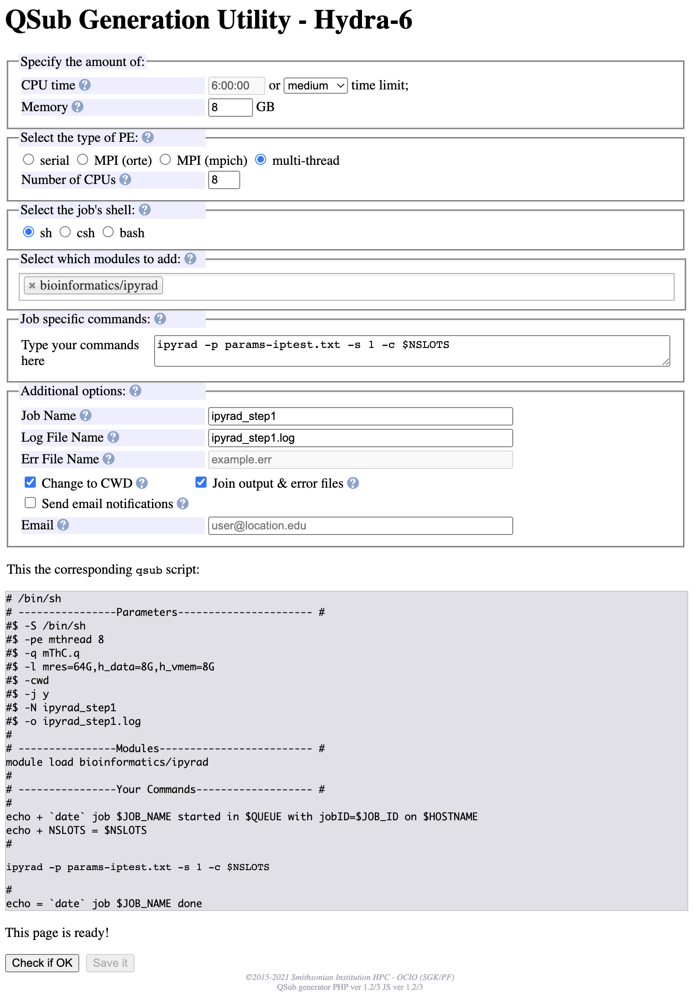

# Running ipyrad on the Hydra cluster

These are instructions for running the [ipyrad "Introductory tutorial"](https://ipyrad.readthedocs.io/en/latest/tutorial_intro_cli.html) on Hydra. The tutorial goes through the ipyrad workflow using a small simulated dataset.

This tutorial is meant to work in conjunction with the [ipyrad "Introductory tutorial"](https://ipyrad.readthedocs.io/en/latest/tutorial_intro_cli.html) which provides additional details for each step. The focus of this  material is to show examples of running the steps on Hydra. What is shown here can be used as a template for submitting job files to the cluster for your analyses.

## [Getting the data](https://ipyrad.readthedocs.io/en/latest/tutorial_intro_cli.html#getting-the-data)

These steps should be run directly on the login node.

Make a tutorial directory:

*Replace `USER` with your Hydra username.*

```
cd /scratch/genomics/USER
mkdir ipyrad-tutorial
cd ipyrad-tutorial
```

Download (`curl`) and expand (`tar`) the sample files:

```
curl -LkO https://eaton-lab.org/data/ipsimdata.tar.gz
tar -xvzf ipsimdata.tar.gz
```

This creates a new `ipsimdata/` directory. It contains several files, the ones in this tutorial are: `./ipsimdata/rad_example_R1_.fastq.gz` and `./ipsimdata/rad_example_barcodes.txt`

- `rad_example_R1_.fastq.gz` is simulated un-paired 100bp illumina reads.
- `rad_example_barcodes.txt` lists each specimen and the barcode used.

## [Create an ipyrad params file](https://ipyrad.readthedocs.io/en/latest/tutorial_intro_cli.html#create-an-ipyrad-params-file)

This should also be run on the login node or an interactive job (`qrsh`)

```
module load bio/ipyrad/0.9.74
ipyrad -n iptest
```

This creates the file `params-iptest.txt` in your current directory:

We'll edit this file to specify the reads file (`rad_example_R1_.fastq.gz`) and barcode file (`rad_example_barcodes.txt`)

`nano` is a text editor you can run on Hydra

```
nano params-iptest.txt
```

With nano, use the arrow keys on the keyboard to edit the lines labeled `[2]` and `[3]` with the location of the read and barcode files.

- At the beginning of the line labeled `[2]` enter: `./ipsimdata/rad_example_R1_.fastq.gz`
- At the beginning of the line labeled `[3]` enter: `./ipsimdata/rad_example_barcodes.txt`

When you've made those changes, the nano screen will look something like this:

```
GNU nano 2.3.1           File: params-iptest.txt                    Modified
------- ipyrad params file (v.0.9.74)-------------------------------------------
iptest                         ## [0] [assembly_name]: Assembly name. Used to n$
/pool/genomics/kweskinm/ipyrad-tutorial ## [1] [project_dir]: Project dir (made$
./ipsimdata/rad_example_R1_.fastq.gz    ## [2] [raw_fastq_path]: Location of ra$
./ipsimdata/rad_example_barcodes.txt    ## [3] [barcodes_path]: Location of bar$
                               ## [4] [sorted_fastq_path]: Location of demultip$
denovo                         ## [5] [assembly_method]: Assembly method (denov$
                               ## [6] [reference_sequence]: Location of referen$
rad                            ## [7] [datatype]: Datatype (see docs): rad, gbs$
TGCAG,                         ## [8] [restriction_overhang]: Restriction overh$
5                              ## [9] [max_low_qual_bases]: Max low quality bas$
33                             ## [10] [phred_Qscore_offset]: phred Q score off$
6                              ## [11] [mindepth_statistical]: Min depth for st$
6                              ## [12] [mindepth_majrule]: Min depth for majori$
10000                          ## [13] [maxdepth]: Max cluster depth within sam$
0.85                           ## [14] [clust_threshold]: Clustering threshold $
0                              ## [15] [max_barcode_mismatch]: Max number of al$
2                              ## [16] [filter_adapters]: Filter for adapters/p$
35                             ## [17] [filter_min_trim_len]: Min length of rea$
2                              ## [18] [max_alleles_consens]: Max alleles per s$
0.05                           ## [19] [max_Ns_consens]: Max N's (uncalled base$
0.05                           ## [20] [max_Hs_consens]: Max Hs (heterozygotes)$
4                              ## [21] [min_samples_locus]: Min # samples per l$
0.2                            ## [22] [max_SNPs_locus]: Max # SNPs per locus
8                              ## [23] [max_Indels_locus]: Max # of indels per $
0.5                            ## [24] [max_shared_Hs_locus]: Max # heterozygou$
0, 0, 0, 0                     ## [25] [trim_reads]: Trim raw read edges (R1>, $
0, 0, 0, 0                     ## [26] [trim_loci]: Trim locus edges (see docs)$
p, s, l                        ## [27] [output_formats]: Output formats (see do$
                               ## [28] [pop_assign_file]: Path to population as$
                               ## [29] [reference_as_filter]: Reads mapped to t$

^G Get Help  ^O WriteOut  ^R Read File ^Y Prev Page ^K Cut Text  ^C Cur Pos
^X Exit      ^J Justify   ^W Where Is  ^V Next Page ^U UnCut Text^T To Spell
```

To save your changes, press and hold the control key while you press o: `ctrl`+`o`

Then, press the `enter` key to save the file.

Next, exit the editor by pressing the control key and x: `ctrl`+`x`

## [Step 1: Demultiplex the raw data files](https://ipyrad.readthedocs.io/en/latest/tutorial_intro_cli.html#step-1-demultiplex-the-raw-data-files)

For the analysis steps of ipyrad we will create job files and submit the jobs to the cluster.

Job files are text file that give instructions to the cluster about your analysis.

### Creating the job file

The "QSub Generation Utility" is a webpage hosted on Hydra for creating job files.

There are two ways to access the page depending on how you are connected to the Smithsonian network.

- If you are using a computer directly connected to the network or have VPN connection, go to: https://hydra-adm01.si.edu/tools/QSubGen/
- If you are using the Smithsonian Telework website, go to the main telework page, https://telework.si.edu, and then enter https://hydra-adm01.si.edu/tools/QSubGen/ in the text box labeled "Enter an internal resource," then press the enter/return key on your keyboard.


Next specify the following options:

- CPU time: Choose "medium" from the dropdown.
- Memory: Change to 8
- "Select the type of PE:" Choose "multi-thread"
- Number of CPUs: Enter 8
- "Select the job's shell": Leave as "sh"
- "Select which modules to add": enter "bioinformatics/ipyrad"
- "Job specific commands": enter "ipyrad -p params-iptest.txt -s 1 -c $NSLOTS"
- "Job Name": Enter ipyrad_step1
- "Log File Name": Confirm that this is set to "ipyrad_step1.log"
- "Err File Name": Do not change
- "Change to CWD": Leave checked
- "Join output & error files": Leave checked
- "Send email notifications": Leave unchecked
- Email: Do not change

You page should now look like this:


When you have finished entering that information, click the "Check if OK" button at the bottom of the page. This will alert you if some common errors are present. If there are no errors, you'll see "Your job will request 8 CPUs, 6d of CPU time and a total of 64GB of memory."


Then, save the file to your computer using the "Save it" file. The job file, ipyard_step1.job, will be saved to your computer, typically in the Downloads directory.

The final step in the process is transferring the file to Hydra.

The way we'll show is using the free cloud transfer utility https://send.vis.ee/

1. Open https://send.vis.ee/ in a browser
1. Drag yourjob file to the area of the window that says "Drag and drop files"

1. Then, click the "Upload" button

1. Click the "Copy Link" button to copy the URL to your file into your computer's clipboard.


The next steps are done on the login node of Hydra in your `ipyrad-tutorial` directory:

```
module load tools/ffsend
ffdownload <PASTE YOUR send.vis.ee URL>
```

**Make sure to replace `<PASTE YOUR send.vis.ee URL>` with the url that you copied from the website**

You'll get the message `Download complete` if it worked and something like `error: failed to follow share URL, ignoring` if it failed. If the download failed, try re-uploading the file to https://send.vis.ee and try again.

Confirm the file is downloaded by viewing it with:

```
cat ipyrad_step1.job
```

Before you use the job file there's one change to make to it.

Edit it with nano:

```
nano ipyrad_step1.job
```

The change this line to specify which version of ipyrad to use:

```
module load bioinformatics/ipyrad
```

To:

```
module load bioinformatics/ipyrad/0.9.74
```

Save and exit nano with `ctrl`+`o`, then the `enter` key, then `ctrl`+`x`

Finally, confirm that your job file matches this one using the cat command:

```
cat ipyrad_step1.job

# /bin/sh
# ----------------Parameters---------------------- #
#$ -S /bin/sh
#$ -pe mthread 8
#$ -q sThC.q
#$ -l mres=64G,h_data=8G,h_vmem=8G
#$ -cwd
#$ -j y
#$ -N ipyrad_step1
#$ -o ipyrad_step1.log
#
# ----------------Modules------------------------- #
module load bioinformatics/ipyrad/0.9.74
#
# ----------------Your Commands------------------- #
#
echo + `date` job $JOB_NAME started in $QUEUE with jobID=$JOB_ID on $HOSTNAME
echo + NSLOTS = $NSLOTS

#
ipyrad -p params-iptest.txt -s 1 -c $NSLOTS
#
echo = `date` job $JOB_NAME done
```

Then use the command `qsub ipyrad_step1.job` to run this job.

It will run on 8 CPUs (defined by `-pe mthread 8`).

We've added `-c $NSLOTS` to the `ipyrad` command. This is **essential** for running on Hydra because it limits ipyrad to only used the 8 CPUs we've requested. Without this, ipyrad will use all the CPUs on the compute node that the job runs on.

You'll notice that the formatting of the job files are almost identical for all the steps. The main thing that changes is the Step specified in the `ipyrad` command. This is step 1, so we have `-s 1`.

**Output**

This command produces a directory `iptest_fastqs/` that has the de-multiplexed fastq files and `iptest.json` which is how ipyrad tracks the analyses done in your project.

You can get a report of the step that ran with this command that you can run from the login node:

```
ipyrad -p params-iptest.txt -r
```

If you get an error like `-bash: ipyrad: command not found`, you need to load the ipyrad module again with: `module load bio/ipyrad/0.9.74`

## [Step 2: Filter reads](https://ipyrad.readthedocs.io/en/latest/tutorial_intro_cli.html#step-2-filter-reads)

This step trims Illumina adapters and does other quality trimming. Unlike some programs, you are not required to do any trimming of your fastq files before you start ipyrad.

The job file for step 2 is almost the same as step one, but we've changed the name (`-N`) and log file (`-o`) as well as the ipyrad command to run step 2 (`-s 2`):

You can make a copy of the Step 1 file and make these edit using `nano` or you can make the change on the QSub Generation Utility and upload the new file.

To copy and edit the file already on Hydra follow these steps:

1. Copy the file: `cp ipyrad_step1.job ipyrad_step2.job`
1. Edit the new file: `nano ipyrad_step2.job`
1. Refer to the contents of ipyrad_step2.job below to changes to the `-N`, `-o` and `ipyrad` lines
1. Save and exit nano with `ctrl`+`o`, then the `enter` key, then `ctrl`+`x`

`ipyrad_step2.job`:

```
# /bin/sh
# ----------------Parameters---------------------- #
#$ -S /bin/sh
#$ -pe mthread 8
#$ -q sThC.q
#$ -l mres=64G,h_data=8G,h_vmem=8G
#$ -cwd
#$ -j y
#$ -N ipyrad_step2
#$ -o ipyrad_step2.log
#
# ----------------Modules------------------------- #
module load bioinformatics/ipyrad/0.9.74
#
# ----------------Your Commands------------------- #
#
echo + `date` job $JOB_NAME started in $QUEUE with jobID=$JOB_ID on $HOSTNAME
echo + NSLOTS = $NSLOTS

#
ipyrad -p params-iptest.txt -s 2 -c $NSLOTS
#
echo = `date` job $JOB_NAME done
```

Like the `ipyrad_step1.job` file, this runs on 8 CPUs (`-pe mthread 8`) and we specify in the `ipyrad` command that it should only use 8 CPUs with `-c $NSLOTS`

You submit this run with the command: `qsub ipyrad_step2.job`

**Output**

This command produces a directory `iptest_edits/` that has the filtered fastq files. This step also updates the exisitng `iptest.json` file with information about this step.

Again, you can get a report of this step by running this command from the login node: `ipyrad -p params-iptest.txt -r`

ipyrad will use the `iptest.json` file to determine the steps you've run and same basic statistics.

## [Step 3: clustering within-samples](https://ipyrad.readthedocs.io/en/latest/tutorial_intro_cli.html#step-3-clustering-within-samples)

ipyrad uses a clustering algorithm to take all the reads for *each sample* and lumps them into putative loci based on sequence similarity. By default this clustering is done at the `0.85` level of similarity. This level can be adjusted in `params-iptest.txt` file.

`ipyrad_step3.job`:

```
# /bin/sh
# ----------------Parameters---------------------- #
#$ -S /bin/sh
#$ -pe mthread 8
#$ -q sThC.q
#$ -l mres=64G,h_data=8G,h_vmem=8G
#$ -cwd
#$ -j y
#$ -N ipyrad_step3
#$ -o ipyrad_step3.log
#
# ----------------Modules------------------------- #
module load bioinformatics/ipyrad/0.9.74
#
# ----------------Your Commands------------------- #
#
echo + `date` job $JOB_NAME started in $QUEUE with jobID=$JOB_ID on $HOSTNAME
echo + NSLOTS = $NSLOTS

#
ipyrad -p params-iptest.txt -s 3 -c $NSLOTS
#
echo = `date` job $JOB_NAME done
```

Submit the jobs with: `qsub ipyrad_step3.job`

**Output**

Step 3 creates a directory `iptest_clust_0.85/` which contains each cluster for each fastq file.

Again, we can get a summary of the step by running `ipyrad -p params-iptest.txt -r` from the login node.

## [Step 4: Joint estimation of heterozygosity and error rate](https://ipyrad.readthedocs.io/en/latest/tutorial_intro_cli.html#step-4-joint-estimation-of-heterozygosity-and-error-rate)

This step uses the clustering information from Step 3 to calculate a heterozygosity rate and sequencing error rate. These will be used in Step 5 to create a consensus sequence for each cluster.

`ipyrad_step4.job`:

```
# /bin/sh
# ----------------Parameters---------------------- #
#$ -S /bin/sh
#$ -pe mthread 8
#$ -q sThC.q
#$ -l mres=64G,h_data=8G,h_vmem=8G
#$ -cwd
#$ -j y
#$ -N ipyrad_step4
#$ -o ipyrad_step4.log
#
# ----------------Modules------------------------- #
module load bioinformatics/ipyrad/0.9.74
#
# ----------------Your Commands------------------- #
#
echo + `date` job $JOB_NAME started in $QUEUE with jobID=$JOB_ID on $HOSTNAME
echo + NSLOTS = $NSLOTS

#
ipyrad -p params-iptest.txt -s 4 -c $NSLOTS
#
echo = `date` job $JOB_NAME done
```

Submit the job with: `qsub ipyrad_step4.job`

**Output**

Step 4 doesn't create a new output directory, but adds a statistics output file, `s4_joint_estimate.txt`, to the existing `iptest_clust_0.85/` directory.

We can get the report form step 4 by running the ipyrad report command again from the command line:
`ipyrad -p params-iptest.txt -r`

## [Step 5: Consensus base calls](https://ipyrad.readthedocs.io/en/latest/tutorial_intro_cli.html#step-5-consensus-base-calls)

In Step 5, ipyrad uses the calculated heterozygosity and error rates to create a consensus sequence for each cluster.

`ipyrad_step5.job`:

```
# /bin/sh
# ----------------Parameters---------------------- #
#$ -S /bin/sh
#$ -pe mthread 8
#$ -q sThC.q
#$ -l mres=64G,h_data=8G,h_vmem=8G
#$ -cwd
#$ -j y
#$ -N ipyrad_step5
#$ -o ipyrad_step5.log
#
# ----------------Modules------------------------- #
module load bioinformatics/ipyrad/0.9.74
#
# ----------------Your Commands------------------- #
#
echo + `date` job $JOB_NAME started in $QUEUE with jobID=$JOB_ID on $HOSTNAME
echo + NSLOTS = $NSLOTS

#
ipyrad -p params-iptest.txt -s 5 -c $NSLOTS
#
echo = `date` job $JOB_NAME done
```

Submit the job with: `qsub ipyrad_step5.job`.

**Output**

This step creates the directory `iptest_consens/` which has the consensus sequences.

Like before, you can get a report of this step by running: `ipyrad -p params-iptest.txt -r`

## [Step 6: Cluster across samples](https://ipyrad.readthedocs.io/en/latest/tutorial_intro_cli.html#step-6-cluster-across-samples)

Step 6 is the first step that combines the sequencing from all the samples. It uses the consensus sequences from Step 5 that were calculated for each sample individually and results in clusters of similar sequences *between* loci.

`ipyrad_step6.job`:

```
# /bin/sh
# ----------------Parameters---------------------- #
#$ -S /bin/sh
#$ -pe mthread 8
#$ -q sThC.q
#$ -l mres=64G,h_data=8G,h_vmem=8G
#$ -cwd
#$ -j y
#$ -N ipyrad_step6
#$ -o ipyrad_step6.log
#
# ----------------Modules------------------------- #
module load bioinformatics/ipyrad/0.9.74
#
# ----------------Your Commands------------------- #
#
echo + `date` job $JOB_NAME started in $QUEUE with jobID=$JOB_ID on $HOSTNAME
echo + NSLOTS = $NSLOTS

#
ipyrad -p params-iptest.txt -s 6 -c $NSLOTS
#
echo = `date` job $JOB_NAME done
```

Submit the job with `qsub ipyrad_step6.job`

**Output**

Output from this step is in the directory `iptest_across/`.

As described in the ipyrad tutorial, you can run `ipyrad -p params-iptest.txt -r`, but there is not useful diagnostic information given.

## [Step 7: Filter and write output files](https://ipyrad.readthedocs.io/en/latest/tutorial_intro_cli.html#step-7-filter-and-write-output-files)

In the final step you filter the data and then output it into a format for downstream analysis.

The filtering parameters are defined in `params-iptest.txt` and this tutorials use the defaults.

`ipyrad_step7.job`:

```
# /bin/sh
# ----------------Parameters---------------------- #
#$ -S /bin/sh
#$ -pe mthread 8
#$ -q sThC.q
#$ -l mres=64G,h_data=8G,h_vmem=8G
#$ -cwd
#$ -j y
#$ -N ipyrad_step7
#$ -o ipyrad_step7.log
#
# ----------------Modules------------------------- #
module load bioinformatics/ipyrad/0.9.74
#
# ----------------Your Commands------------------- #
#
echo + `date` job $JOB_NAME started in $QUEUE with jobID=$JOB_ID on $HOSTNAME
echo + NSLOTS = $NSLOTS

#
ipyrad -p params-iptest.txt -s 7 -c $NSLOTS
#
echo = `date` job $JOB_NAME done
```

Start this step with `qsub ipyrad_step7.job`

**Output**

This creates the directory `iptest_outfiles` which has your output files in various formats.

You can view less files with:

```
ls iptest_outfiles
```

A final statistics file is viewable in the `iptest_outfiles` directory

```
cat iptest_outfiles/iptest_stats.txt
```

## Next steps

From this we hope that you have an understanding to run ipyrad commands on Hydra.

A good next-step is to go through the ipyrad (Advanced tutorial)[https://ipyrad.readthedocs.io/en/latest/tutorial_advanced_cli.html] which covers branching and analyses when there's a reference genome. Branching allows you to re-use existing steps when trying variations on analysis rather than returning to the first step every time.
