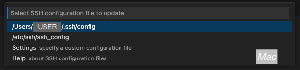
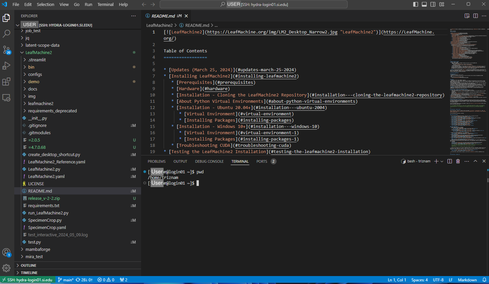

# Setting up VS Code for Hydra Connection

Instructions for using VS Code to connect to Hydra via SSH. This connection type requires a computer on the Smithsonian network or VPN connection.

First step is to install VS Code. Go to <https://code.visualstudio.com/> and click on the download link.

Once it is installed open the program and click on the Extension button on the left side.

Then search for the word "remote" to pull up a bunch of results. Click Install on the first option, which should be "Remote Development", which is an extension pack that will install multiple extensions published by Microsoft.

If this worked, it will show that multiple extensions are now installed.

Now click on the new Remote Explorer icon on the left sidebar. Hover over the "SSH" section and then click on the + icon to add an SSH connection to Hydra.

A little panel will show up in the top middle of VS Code with an example SSH connection command. Fill it in with `ssh USER@hydra-login01.si.edu`.

You will then get a follow-up prompt that asks where to store this config. Choose the first option. Windows: `C:\Users\USER\.ssh\config`, Mac: `/Users/USER/.ssh/config`

*Windows*

*Mac*

It will do a little bit of thinking, but then you should see the Hydra SSH connection added to your Remote Explorer tab.

Click on the icon either for "Connect in Current Window" or "Connect in New Window" to connect to Hydra. It doesn't really matter which one you choose.

You may get a warning about the SSH fingerprint that is displayed in the top middle of the VS Code window. If so, click "Continue".

It will again open up a little prompt in the top middle of VS Code, which asks for your Hydra password. Enter it here, and press enter.

If this is the first time using VS Code on Hydra you may be prompted about the OS of the remote system, choose "Linux." It will take a while to install VS Code helper files on Hydra in your space. But when it finishes, you should see the options to Open Folder, and it will also open up a Terminal window for you.

Here is an example screenshot of a home folder where we've clicked on a random file that shows how it opens it up in the Editor pane. There's also a command in the Terminal at that bottom, that shows that the path between the Explorer pane and the terminal location can get slightly disconnected.

